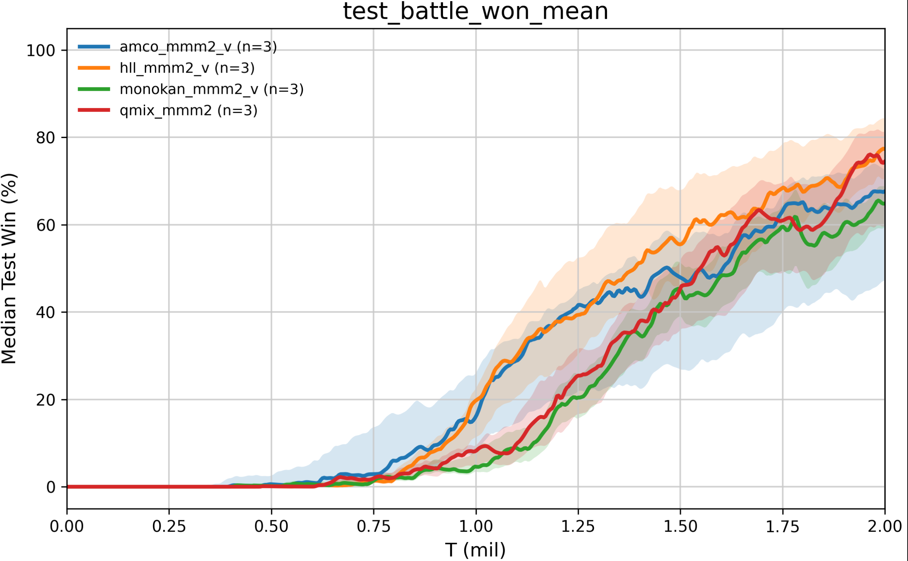

# 2026年06月25日

## 实验或 idea 的进展

### 实验进展

- 本周完成了哪些实验：将上周跑的结果比较好的模型分别在两个地图上跑三轮结果取中位数值并进行分析

- 实验设置：pymarl框架、MMM2和3s\_vs\_5z地图

#### **第一轮实验**

##### **实验结果**

1\. 在3s\_vs\_5z地图中，有些模型的结果已经显著超越了QMIX，MMM2地图中差别不是特别明显
2\. 在第一个图中效果好的模型，在第二个图中效果不一定好
3\. hll方法在3s\_vs\_5z地图中效果不太好，三个seed只有一个有效果，其他都崩了




##### **初步分析**

HLL 的 lattice size 默认是：

```Plain Text
hll_lattice_size: 2
```

这带来一个非常关键的问题：HLL 的容量随 agent 数指数变化。

如果是 MMM2，通常 `n_agents=10`，那么 binary lattice 有：

```Plain Text
2^10 = 1024 vertices
```

这其实是一个相当强的状态条件化单调函数面。

但 `3s_vs_5z` 只有 3 个己方 agent：

```Plain Text
2^3 = 8 vertices
```

这就太小了。HLL 在 `3s_vs_5z` 上其实退化成了一个只有 8 个顶点的低容量 multilinear monotone mixer。它可能不足以表达 kiting 里那种非线性的动作价值变化，尤其是距离、血量、集火目标变化带来的阈值行为。

代码中有几个风险点。

第一，`q_coordinates` 使用 sigmoid：

```Plain Text
q_coordinates = th.sigmoid(agent_qs / self.q_temperature)
```

如果 agent Q 的尺度变大，sigmoid 进入饱和区，`∂q_coordinates/∂Q_i` 会变小，agent 端收到的 credit signal 会弱。某些 seed 下早期 Q 尺度如果偏掉，HLL 很容易变成几乎不给 agent 有效梯度。

第二，lattice 输出被限制在 `[0, 1]`，然后中心化：

```Plain Text
q_tot = output_scale * (lattice_output - 0.5)
```

这意味着真正的尺度主要由 `output_scale(states)` 控制。如果某个 seed 下 `output_scale` 学得太保守，或者 lattice 输出长期靠近 0\.5，`Q_tot` 对动作差异就会很小，策略无法起飞。

**MonoKAN 为什么在 3s\_vs\_5z 强**
MonoKAN 当前实现更符合真正 partial monotone 的思想：

```Plain Text
first_mask = [1] * n_agents + [0] * state_feature_dim
```

也就是第一层只对 agent Q 输入施加单调约束，对 state feature 是自由的。

它的优势是：每条输入边是可学习 Hermite spline，能表达局部非线性。`3s_vs_5z` 的 kiting 行为很可能有明显阈值结构，比如距离、血量、追击/撤退切换，MonoKAN 的 spline 更适合这种局部形状。

为什么 MMM2 上 MonoKAN 不如 HLL/QMIX？因为 MMM2 的 agent 数更多、类型异质更强。MonoKAN 当前：

```Plain Text
monokan_hidden_dim: 32
monokan_grid: 7
monokan_state_embed_dim: 32
```

对 10\-agent MMM2 来说可能容量偏小。它能学，但 global state\-conditioned credit surface 没有 HLL/QMIX 那么直接。

MonoKAN 修改建议
对 MMM2：

```Plain Text
monokan_hidden_dim: 64
monokan_state_embed_dim: 64
monokan_q_temperature: 2.0
```

如果显存允许，可以试：

```Plain Text
monokan_grid: 9
```

但我会优先调 `hidden_dim` 和 `q_temperature`，因为 grid 太大可能增加训练不稳定。


**AMCO 为什么 3s\_vs\_5z 好，但 MMM2 一般**

它在 `3s_vs_5z` 表现很好，说明这个地图对复杂异质 credit 的需求没那么强，AMCO 的保守单调 MLP 足够学到有效策略。

但代码里 AMCO 有两个专业上必须注意的问题。

第一，它并不是真正的 partial monotone。

你的注释说 state 是 free input，但实际：

```Plain Text
AMCOMonotonicLinear(in_dim, ...)
```

作用在拼接后的 `[Q, z]` 全部维度上。也就是说 state embedding 维度也进入了单调结构。虽然 `z=g(s)` 是自由 MLP，但 mixer 对 `z` 坐标本身不是完全自由的。

第二，`AMCOMonotonicLinear` 里 bias 被加了两次：

```Plain Text
x_pos = F.linear(self.act(x), w_pos, self.bias)
x_neg = F.linear(self.act(-x), w_neg, self.bias)
return x_pos + x_neg
```

这等价于加了 `2 * bias`。建议改成：

```Plain Text
x_pos = F.linear(self.act(x), w_pos, self.bias)
x_neg = F.linear(self.act(-x), w_neg, None)
return x_pos + x_neg
```

或者：

```Plain Text
return F.linear(self.act(x), w_pos, None) + F.linear(self.act(-x), w_neg, self.bias)
```

AMCO 修改建议
最关键是改成真正 partial monotone 第一层：

```Plain Text
h = F.linear(agent_qs, W_q_positive, None) + F.linear(state_features, W_z_free, b)
h = act(h)
```

后续 hidden\-to\-hidden 层保持正权重。这样才是严格的：

```Plain Text
monotone in Q, free in z
```

对 MMM2，这个修改应该比单纯加大 hidden 更重要。

#### **第二轮实验：Modify\_v1**

##### **具体修改**

1. AMCO
已改成真正 partial monotone：

```Plain Text
Q 分支：单调权重
state feature 分支：自由权重
后续 hidden 层：AMCO monotone layer
```

同时修复了原 `AMCOMonotonicLinear` 中 bias 被加两次的问题。

2. HLL
新增 map\-aware 参数读取：

```Plain Text
hll_lattice_size_by_map:
  MMM2: 2
  3s_vs_5z: 6
```

我选择 `3s_vs_5z: 6`，因为 `6^3=216`，比原来的 `2^3=8` 表达力强很多；但没有激进到 `8^3=512` 或 `10^3=1000`，避免 auxiliary network 输出维度过大导致训练不稳定和 seed 方差扩大。

3. MonoKAN
新增 map\-aware 参数：

```Plain Text
monokan_state_embed_dim_by_map:
  MMM2: 64
  3s_vs_5z: 32

monokan_hidden_dim_by_map:
  MMM2: 64
  3s_vs_5z: 32

monokan_grid_by_map:
  MMM2: 9
  3s_vs_5z: 7

monokan_q_temperature_by_map:
  MMM2: 2.0
  3s_vs_5z: 1.0
```

逻辑是：MMM2 更复杂、agent 异质性更强，所以给 MonoKAN 更大容量；`3s_vs_5z` 你已有结果很好，所以保持较稳配置。

##### **实验结果**


##### **结果分析**

**1\. HLL**

`HLL-3s_vs_5z` 这次其实是有改善的：

```Plain Text
seed1:  last=0.9500, peak=0.9500, ge50≈1.41M
seed41: last=0.7375, peak=0.7625, ge50≈1.78M
```

之前 HLL 在 `3s_vs_5z` 上经常接近完全失败，所以 `lattice_size=6` 的确缓解了原来 `2^3=8` 顶点表达力太弱的问题。

但它仍然学得晚，原因大概率不是 lattice 继续不够大，而是：

1. `q_coordinates = sigmoid(Q / temperature)` 容易饱和。
当个体 Q 值尺度变大后，sigmoid 的梯度会变小，`Qtot` 对 `Qi` 的敏感度下降，信用分配信号变迟。

2. HLL 没有显式 `sum(Q_i)` 或 VDN residual。
目前是：

```Plain Text
q_tot = state_value(states) + output_scale * (lattice_output - 0.5)
```

`state_value(states)` 只提供 state baseline，不参与 action ranking。也就是说，真正影响 decentralized policy 的只有 lattice branch。如果 lattice branch 早期梯度弱，策略学习就会很晚。

3. `lattice_size=6` 已经足够大，继续加到 8 或 10 可能会让 auxiliary network 输出更难学。
所以我不建议继续盲目增大 lattice size。

更合理的下一步是：**调高 ****`hll_q_temperature`**** 到 2\.0 或 3\.0，并考虑加一个小的 Q residual**。比如：

```Plain Text
q_tot = self.state_value(states) + alpha * agent_qs.sum(dim=2, keepdim=True) + interaction
```

其中 `alpha` 可以从 `0.5` 或 `1.0` 开始。这个 residual 比 state residual 更关键，因为它直接提供 action\-dependent 单调通路。

**2\. AMCO**

AMCO 的现象很典型：`3s_vs_5z` 最终不错，但变慢；`MMM2` 出现一个 seed 很好、一个 seed 崩。

`3s_vs_5z`：

```Plain Text
seed1:  last=0.9812, peak=0.9812, ge50≈0.866M
seed41: last=0.9062, peak=0.9437, ge50≈1.449M
```

`MMM2`：

```Plain Text
seed1:  last=0.8000, peak=0.8000
seed41: last=0.1688, peak=0.2562
```

这说明 AMCO 的修改不是简单“变强”或“变弱”，而是 **表达能力变强后，优化方差也显著变大**。

你这次把 AMCO 第一层改成真正 partial monotone：

- Q 分支单调；

- state feature 分支自由；

- 后续 hidden 层保持 AMCO monotone。

这个结构在函数类上是更正确的。但是问题是：**自由 state 分支可能在早期压过 Q 分支**。

尤其是 MMM2 state 维度大、异质性强，state encoder 输出很容易成为 hidden 表示的主导项。这样 mixer 可以很好地拟合状态价值，但 `Qtot` 对个体 `Qi` 的有效敏感度不够稳定。结果就是 TD loss 可能下降，但 policy improvement 不稳定，最终体现为一个 seed 学会、另一个 seed 崩掉。

另外，你修复了 `AMCOMonotonicLinear` bias 被加两次的问题。这个修复数学上是对的，但它也改变了原模型的有效初始化和偏置尺度。之前那个“错误 bias”可能反而给了网络更强的平移能力，使训练更容易启动。修复后如果不重新调初始化，可能会让前期 learning signal 变弱。

AMCO 下一步我建议重点不是加深网络，而是限制 state 分支：

```Plain Text
hidden = q_part + state_scale * state_part
```

其中：

```Plain Text
amco_state_input_scale: 0.1 或 0.3
```

这会保留 partial monotone 的表达力，但防止 state feature 过早支配 action\-dependent branch。

同时也建议加诊断日志：

- `||q_part||`

- `||state_part||`

- `||state_part|| / ||q_part||`

- `dQtot/dQi` 的均值、最小值、最大值

如果崩掉的 seed 中 `state_part` 明显大于 `q_part`，那基本就坐实了这个判断。

**3\. MonoKAN**

MonoKAN 在 MMM2 上这轮没有提升：

```Plain Text
seed1:  last=0.7000, peak=0.7000
seed41: last=0.5687, peak=0.6438
```

你给 MMM2 加了更大容量：

```Plain Text
state_embed_dim: 64
hidden_dim: 64
grid: 9
q_temperature: 2.0
```

这里最可疑的是 `q_temperature=2.0`。

MonoKAN 当前是：

```Plain Text
q_features = tanh(agent_qs / q_temperature)
```

如果 temperature 从 1\.0 增加到 2\.0，早期在接近 0 的区域，`d tanh(Q/T) / dQ` 大约会被压低到原来的一半。它确实能减少饱和，但如果原来的 Q 并没有严重饱和，这个改动就等于削弱了 action\-dependent 梯度。

同时你还把 `grid` 和 `hidden_dim` 一起增大了。KAN 的 spline 容量变大后，不一定更适合 off\-policy TD 学习；它可能更容易拟合 value target 的局部噪声，反而不利于稳定策略改进。

所以 MonoKAN 的下一轮不要同时改三四个参数。建议做 ablation：

```Plain Text
# A: 只增大 hidden
hidden_dim: 64
grid: 7
q_temperature: 1.0

# B: 只增大 grid
hidden_dim: 32
grid: 9
q_temperature: 1.0

# C: 只测试 temperature
hidden_dim: 32
grid: 7
q_temperature: 2.0
```

我现在最怀疑 C 会更差，A 可能更稳，B 不一定有收益。

**核心原因**

这轮没有明显提升的根本原因是：

**你目前主要在增强 mixer 的状态交互表达能力，但没有增强 action\-dependent credit assignment 的稳定通路。**

state residual 是有用的，但它不是解决 IGM 学习的核心。因为：

```Plain Text
V(s)
```

不依赖动作，不影响 greedy action ranking。

真正决定策略能否学起来的是：

```Plain Text
dQtot / dQi
```

如果这个梯度太小、太晚、被 state branch 掩盖，或者不同 seed 下波动很大，那么 mixer 即使表达能力更强，`test_battle_won_mean` 也不会提升，甚至会更差。


> （注：部分内容可能由 AI 生成）
