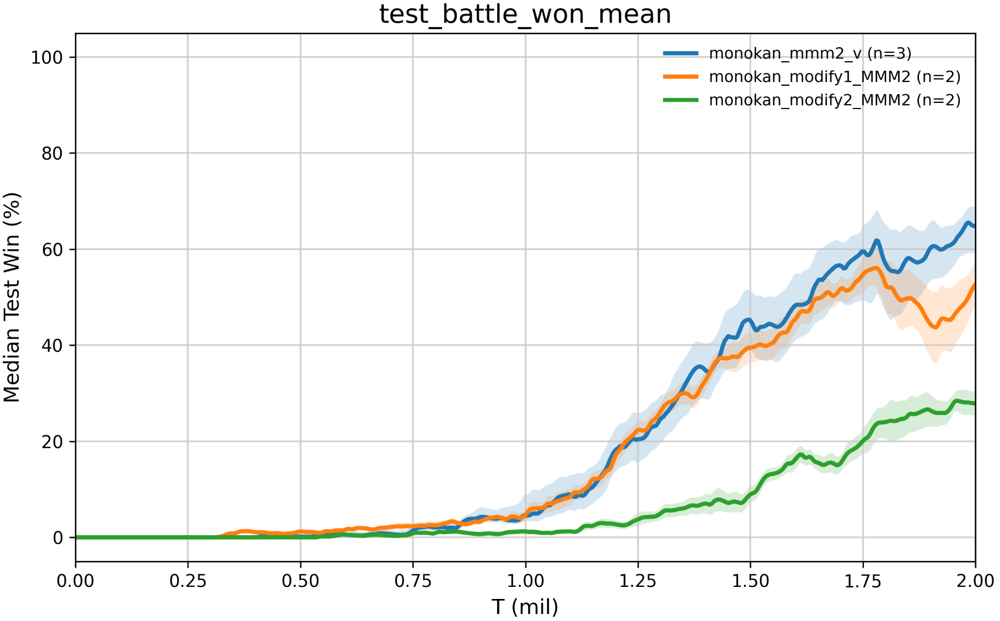

# 2026年07月02日

## 实验或 idea 的进展

### 实验进展

#### **第三轮实验：Modify\_v2**

##### 具体修改

**所有 partial monotone mixer 增加 Q 残差通路**

- 在 `AMCO / HLL / MonoKAN` 中加入：

```Plain Text
q_residual = q_residual_scale * agent_qs.sum(dim=1, keepdim=True)
q_tot = interaction + state_value(states) + q_residual
```

- 新增配置项：

```Plain Text
*_q_residual_scale: 0.5
*_q_residual_scale_by_map:
  MMM2: 0.5
  3s_vs_5z: 0.5
```

- 理由：`V(s)` 不影响动作排序，不能替代 action\-dependent credit path。`sum(Q_i)` 是单调的，可以保留 IGM，并给训练早期提供稳定梯度。

**AMCO：限制 state 分支支配 Q 分支**

- 在 `AMCOPartialMonotonicInputLayer` 中加入 `state_input_scale`：

```Plain Text
return q_term + state_input_scale * state_term
```

- 新增配置：

```Plain Text
amco_state_input_scale: 0.3
amco_state_input_scale_by_map:
  MMM2: 0.1
  3s_vs_5z: 0.3
```

- MMM2 用更小的 `0.1`，因为它 state 维度更复杂，`modify_v1` 中 AMCO 的 seed 崩溃很可能来自 state branch 早期压过 Q branch。

- `3s_vs_5z` 用 `0.3`，保留 state interaction 表达力，同时降低 seed 方差。

**HLL：不再增大 lattice，改 Q 温度和 Q 残差**

- 保持：

```Plain Text
hll_lattice_size_by_map:
  MMM2: 2
  3s_vs_5z: 6
```

- 新增或修改：

```Plain Text
hll_q_temperature_by_map:
  MMM2: 1.0
  3s_vs_5z: 2.0
hll_q_residual_scale_by_map:
  MMM2: 0.5
  3s_vs_5z: 0.5
```

- 理由：`3s_vs_5z` 上 HLL 已经因为 lattice=6 明显改善，继续增大 lattice 不是优先方向。当前主要问题是 sigmoid 坐标变换导致 Q 梯度偏弱、学习偏晚，所以提高 temperature 更合理。

**MonoKAN：回退 MMM2 的过强容量修改**

- 修改 MMM2 map\-aware 参数为：

```Plain Text
monokan_state_embed_dim_by_map:
  MMM2: 64
  3s_vs_5z: 32

monokan_hidden_dim_by_map:
  MMM2: 64
  3s_vs_5z: 32

monokan_grid_by_map:
  MMM2: 7
  3s_vs_5z: 7

monokan_q_temperature_by_map:
  MMM2: 1.0
  3s_vs_5z: 1.0

monokan_q_residual_scale_by_map:
  MMM2: 0.5
  3s_vs_5z: 0.5
```

- 理由：`modify_v1` 同时增大 hidden、grid、temperature，结果没有提升。最可疑的是 `q_temperature=2.0` 削弱了 `dQtot/dQi`，`grid=9` 也可能增加 TD 拟合噪声。先保留 hidden=64，回退 grid 和 temperature。

##### **实验结果**

以下是每个模型两次modify与原配置的对比，

**amco on 3s\_vs\_5z**


**Hll on 3s\_vs\_5z**


**amco on MMM2**


**Monokan on MMM2**



**修改了两个版本之后，取所有方法的最优策略并画图，可以发现，还是能挑出来一个效果比QMIX都要好的\(hll\)**


##### 结果分析

**HLL: **

这里 `modify_v2` 是成功的。尤其 HLL，之前最大问题是学习很晚、seed 容易崩，`modify_v2` 后三条 seed 都能起来，而且达到 50%/75% 的时间大幅提前。这个说明：**HLL 的问题确实主要是 action\-dependent 梯度太弱，Q residual \+ temperature=2\.0 是对症的。**

**MMM2:**

MMM2 上 `modify_v2` 明显比 `modify_v1` 差。尤其 MonoKAN，`modify_v1` 两个 seed 的 last 大概是 `0.70 / 0.5687`，而 `modify_v2` 完整两个 seed 只有 `0.3125 / 0.1875`。这说明我们对 MonoKAN 的判断需要修正：**MMM2 上之前的 grid=9、temperature=2\.0 并不是主要问题，反而可能是有帮助的。真正破坏训练的更可能是 Q residual 的尺度。**

**为什么 3s 有效、MMM2 失败**

最重要的原因是：

```Plain Text
q_residual = 0.5 * sum(Q_i)
```

这个 residual 在 `3s_vs_5z` 里只有 3 个 agent，但在 MMM2 里有 10 个 agent。也就是说，同样的 `0.5`，在 MMM2 上 action residual 的量级天然大很多。

这会带来两个问题：

1. **MMM2 被过度 VDN 化**

`sum(Q_i)` 是一个强 additive prior。
在 `3s_vs_5z` 这种相对同质、低 agent 数地图上，它是好事：提供稳定信用分配。

但 MMM2 是异质复杂地图，10 个 agent 之间需要更强 state\-conditioned coordination。过强的 `sum(Q_i)` 会让 mixer 更依赖个体局部价值，而不是状态条件下的交互项。结果可能是：模型能学到“打伤/杀敌”，但学不到“赢”。

你日志里也能看到这个特征。例如 AMCO MMM2 崩掉的 seed 后期：

```Plain Text
test_dead_enemies_mean ≈ 7
test_battle_won_mean = 0
```

这很关键。它不是完全不会打，而是策略学到了局部击杀，却没有形成能赢的联合策略。

2. **Q residual 绕过了 partial monotone mixer 本体**

我们设计 partial monotone mixer 的初衷是让：

```Plain Text
Qtot = F(Q1, ..., Qn, z) + V(s)
```

其中 `z` 允许状态自由影响 Q 之间的组合关系。

但如果 residual 太强：

```Plain Text
Qtot ≈ 0.5 * sum(Q_i)
```

那么复杂 mixer 的 state\-conditioned interaction 反而被削弱。

这对 HLL\-3s 是救命药，对 MMM2 则变成了过强偏置。

**AMCO :**

AMCO 在 `3s_vs_5z` 上，`modify_v2` 是目前最稳的版本之一。`state_input_scale=0.3 + q_residual=0.5` 是有效的。

但 AMCO 在 MMM2 上失败，原因应该是两个修改共同造成的：

```Plain Text
amco_state_input_scale_by_map:
  MMM2: 0.1
amco_q_residual_scale_by_map:
  MMM2: 0.5
```

这等于一边压低 state branch，一边增强 additive Q branch。

对 MMM2 来说方向反了：MMM2 恰恰需要更强 state\-conditioned coordination。

#### 第四轮实验：Modify\_v3

##### 具体修改

**AMCO\-MMM2**

当前 `mean residual=0.5` 可能仍偏强。建议更保守：

```Plain Text
amco_state_input_scale_by_map:
  MMM2: 0.3
  3s_vs_5z: 0.3

amco_q_residual_scale_by_map:
  MMM2: 0.25
  3s_vs_5z: 0.5

amco_q_residual_mode_by_map:
  MMM2: "mean"
  3s_vs_5z: "sum"
```

理由：AMCO\-MMM2 的问题是 state/Q 分支平衡，不是简单缺少 additive prior。`mean * 0.25` 更稳。

**MonoKAN\-MMM2**

不要关闭 residual。应该测试真正有信息量的版本：

```Plain Text
monokan_grid_by_map:
  MMM2: 9
  3s_vs_5z: 7

monokan_q_temperature_by_map:
  MMM2: 2.0
  3s_vs_5z: 1.0

monokan_q_residual_scale_by_map:
  MMM2: 0.5
  3s_vs_5z: 0.5

monokan_q_residual_mode_by_map:
  MMM2: "mean"
  3s_vs_5z: "sum"
```

这样三版关系才清楚：

```Plain Text
v1: 大容量 MonoKAN，无 residual
v2: 小容量 MonoKAN，sum residual，失败
v3: 大容量 MonoKAN，mean residual
```

这才能判断 residual 是否真的有帮助。

##### 实验结果

**AMCO**


**monocan**


##### 结果分析

**AMCO\-MMM2 的主要问题不是 partial monotone 架构错，而是 v2 的 residual 太强且未按 agent 数归一化，同时 state branch 被压得太低。**

但 3\.1 和 3\.2 的差异也很关键：

```Plain Text
0.25 mean residual:
  对 seed 1 / 338784093 更快、更高；
  但 seed 41 仍然崩。

0.1 mean residual:
  对 seed 41 明显更稳；
  但 seed 1 / 338784093 学得慢一些。
```

这说明 AMCO 的 residual 有一个典型 bias\-variance tradeoff：

- residual 大：学习启动快，但更容易落入 additive/VDN\-like 局部最优；

- residual 小：更稳，但早期信用分配信号弱一些。

所以 AMCO 下一步最优不是继续试很大的 residual，而是试中间值：

```Plain Text
amco_q_residual_scale_by_map:
  MMM2: 0.15 或 0.2
```

我更推荐 `0.15`。
因为 `0.25` 已经让 seed 41 崩得比较明显，`0.1` 能救 seed 41，但好 seed 稍慢。`0.15` 是最有希望兼顾启动速度和稳定性的点。

**MonoKAN\-MMM2 结果**

MonoKAN 3\.1：

```Plain Text
residual = 0.5 * mean(Q_i)

seed 1:
  last 0.2687
  peak 0.2750

seed 41:
  last 0.1875
  peak 0.1875

seed 338784093:
  last 0.0750
  peak 0.1375
```

和 v1 对比：

```Plain Text
MonoKAN v1:
  seed 1: last 0.7000, peak 0.7000
  seed 41: last 0.5687, peak 0.6438
```

和 origin 对比：

```Plain Text
MonoKAN origin:
  full runs median last ≈ 0.672
  peak median ≈ 0.716
```

所以 MonoKAN 3\.1 是明确失败的。

这不是容量问题，因为 3\.1 已经恢复了 v1 的容量：

```Plain Text
grid: 9
q_temperature: 2.0
hidden_dim: 64
state_embed_dim: 64
```

失败主要来自 residual。

更深层原因是 MonoKAN 的 Q branch 和 residual branch 尺度不一致：

MonoKAN 内部使用：

```Plain Text
q_features = tanh(agent_qs / q_temperature)
```

也就是说，KAN 看到的是 bounded Q feature，范围大致在 `[-1, 1]`。

但 residual 使用的是 raw Q：

```Plain Text
q_residual = scale * mean(agent_qs)
```

这条通路没有 tanh 校准，也不经过 spline/KAN 的单调结构。结果是：raw Q residual 直接给 agent 网络一个强 shortcut，可能破坏 MonoKAN 原本比较细腻的 state\-conditioned spline mixing。

AMCO 是多层 monotone MLP，raw Q residual 对它是辅助；

MonoKAN 是 calibrated spline mixer，raw Q residual 对它可能是干扰。

所以我现在会修正之前的判断：

**MonoKAN\-MMM2 不应该继续尝试较大的 raw Q residual。**

#### **第五轮实验：Modify\_v4**

##### 具体修改

**AMCO 下一步**

优先试：

```Plain Text
amco_q_residual_scale_by_map:
  MMM2: 0.15
  3s_vs_5z: 0.5

amco_q_residual_mode_by_map:
  MMM2: "mean"
  3s_vs_5z: "sum"

amco_state_input_scale_by_map:
  MMM2: 0.3
  3s_vs_5z: 0.3
```

原因：

- `0.25` 对好 seed 很强，但 seed 41 崩。

- `0.1` 对 seed 41 更稳，但好 seed 稍慢。

- `0.15` 是现在最值得测试的平衡点。

如果只跑一组 AMCO，我会选 `0.15`。
如果能跑两组，跑：

```Plain Text
AMCO-A: 0.15 * mean(Q)
AMCO-B: 0.2 * mean(Q)
```

但我更偏向 `0.15`。

**MonoKAN 下一步**

不建议继续大规模跑 raw residual。

下一步最好改代码，增加 residual mode：

```Plain Text
monokan_q_residual_input: "raw" | "tanh"
```

然后让 MMM2 用：

```Plain Text
monokan_q_residual_input_by_map:
  MMM2: "tanh"

monokan_q_residual_scale_by_map:
  MMM2: 0.25
```

##### 实验结果


##### 结果分析

1. **最初版本的 inductive bias 反而更适合 MMM2**

MMM2 是 10\-agent 异质 hard map。它需要的不是简单更强的 `sum/mean(Q_i)` action shortcut，而是稳定的 state\-conditioned coordination。

最初的 MonoKAN / AMCO 本质上更依赖：

```Plain Text
F(Q, z) + V(s)
```

而不是：

```Plain Text
F(Q, z) + V(s) + residual(Q)
```

这迫使 mixer 去学习状态条件下的交互。我们后面加 residual，虽然提供了更直接的 action\-dependent gradient，但也引入了一个强先验：**个体 Q 的平均值本身就应该解释 Qtot**。这在 3s\_vs\_5z 有帮助，在 MMM2 反而会把策略推向局部击杀、局部价值，而不是全局胜利。

2. **MMM2 上 residual 会制造“赢不了但能杀敌”的局部最优**

AMCO 和 MonoKAN 的失败 run 里经常出现：

```Plain Text
dead_enemies_mean 不低
battle_won_mean 不高
```

这说明模型不是完全不会打，而是学到了“杀一些敌人”的局部策略，却没有学到 MMM2 需要的走位、集火、异质兵种协同。

这正是 additive residual 容易造成的问题：它强化个体 Q 的局部可解释性，但 MMM2 的胜利不是简单个体价值相加。

3. **MonoKAN 的结构本来就不需要 residual**

MonoKAN 原始版本在 MMM2 上本来就很强：

```Plain Text
origin median last ≈ 0.67
v1 median last ≈ 0.63
```

后续所有 residual 版本：

```Plain Text
v2 sum residual: 明显下降
v3 raw mean residual: 明显下降
v4 tanh mean residual: 仍明显下降
```

这已经不是 residual 强度的问题，而是结构不匹配。MonoKAN 的 spline 分支依赖校准后的 Q features 和 state features 学习非线性交互；额外 residual 会绕开或干扰这个 spline mixer 的表示学习。

即使 v4 用了 tanh residual，仍然差，说明问题不只是 raw Q 尺度，而是 **shortcut 本身改变了优化路径**。

4. **AMCO 的 residual 有帮助，但只能帮助稳定性，不一定提升上限**

AMCO v4\_1 是最好的例子：

```Plain Text
三个 seed 都稳定到 0.66-0.68
```

它比 v2/v3 稳，也比很多差 seed 好。但它没有超过最强 origin/早期 AMCO 曲线。这说明 residual 对 AMCO 的作用主要是：

```Plain Text
降低崩溃概率，提高下限
```

但代价是：

```Plain Text
限制 state-conditioned interaction 的上限
```

v4\_2 的 seed 141 能到 0\.89，说明 AMCO 架构有潜力；但 seed 41 崩到 0\.225，说明 residual 稍强后训练方差迅速变大。

#### 第六轮实验：Modify\_v5

##### 具体修改

**amco**

新增 residual annealing，而不是固定 scale：

```Plain Text
amco_q_residual_scale_by_map:
  MMM2: 0.15

amco_q_residual_final_scale_by_map:
  MMM2: 0.0

amco_q_residual_anneal_steps_by_map:
  MMM2: 1000000
```

也就是前 1M 步从 `0.2` 线性降到 `0`。
这能保留早期启动优势，又减少后期 additive bias。

**monokan**

做一个真正不同于 v1、且有清晰假设的版本：

```Plain Text
MonoKAN-MMM2 next:
  state_embed_dim: 64
  hidden_dim: 64
  grid: 8
  q_temperature: 1.5
  noise_scale: 0.01
  q_residual_scale: 0.0
```

1. `grid: 8`

v1 用 9，origin 用 7。
v1 没有超过 origin，说明 9 不一定更好；但直接回到 7 又太像 origin。
`grid=8` 是中间值，保留比 origin 更强的 spline 表达，但减少 v1 的局部自由度。

2. `q_temperature: 1.5`

origin 是 1\.0，v1 是 2\.0。
`temperature=2.0` 会让：

```Plain Text
q_features = tanh(Q / 2.0)
```

变得更平，早期 Q 梯度更弱。
但 `temperature=1.0` 又可能更容易饱和。
`1.5` 是更合理的中间点。

3. `noise_scale: 0.01`

当前 `noise_scale=0.02`，对 KAN spline 参数来说可能偏大。
在 TD 学习里，目标本来就 noisy，再加 spline 初始化扰动，可能增加 seed 方差。
减到 `0.01` 是为了让初始 mixer 更平滑、更接近稳定单调函数。

4. 保持 `hidden_dim=64, state_embed_dim=64`

不把容量直接退回 origin。

这样这组不是“重跑 origin”，也不是“重跑 v1”，而是：

```Plain Text
v1 capacity backbone + smoother spline + intermediate Q calibration
```

##### 实验结果


##### 结果分析

说明我们前面的核心判断是对的：AMCO 的问题主要是 fixed residual 压制后期 mixing，所以 annealing 是有效方向；MonoKAN 的问题不是 residual，而是容量/平滑度设置，v5 有明显恢复，但仍存在 seed 崩溃。

**MonoKAN 的 residual 路线基本可以放弃。**
v5 的提升来自三个因素：

```Plain Text
1. residual 关闭
2. grid 从 9 降到 8，减少 spline 局部自由度
3. temp 从 2.0 降到 1.5，提高 Q feature 敏感度
4. noise 从 0.02 降到 0.01，使初始 spline 更平滑
```

目前最清楚的结论有三个：

1. **AMCO 的 residual annealing 成功。**
固定 residual 会压制后期 state\-conditioned mixing；慢退火解决了这个问题。

2. **MonoKAN 不适合 Q residual。**
raw residual、mean residual、tanh residual 全部显著差于 no\-residual。

3. **MMM2 的关键不是更强 additive credit path，而是早期辅助 \+ 后期释放复杂 mixer。**
这就是 AMCO `0.2 -> 0, 1.5M` 成功的原因。

#### 第七轮实验：Modify\_v6

##### 具体修改

```Plain Text
monokan_state_embed_dim_by_map:
  MMM2: 64

monokan_hidden_dim_by_map:
  MMM2: 32

monokan_grid_by_map:
  MMM2: 7

monokan_q_temperature_by_map:
  MMM2: 1.0

monokan_noise_scale: 0.01

monokan_q_residual_scale_by_map:
  MMM2: 0.0
```

也就是：**保留更强的 state 表征，但把 Q\-KAN 主干退回 origin 级别**。这样不是简单重跑 origin，因为 state embedding 更强、noise 更小；但它避免了 v1/v5 里 `hidden=64 + grid>=8 + temperature>1` 可能带来的训练不稳定。

核心判断是：MonoKAN 在 MMM2 上不是缺 state encoder，而是 **Q 分支非线性太灵活以后，TD 训练下 seed 方差被放大**。AMCO 可以靠 residual annealing 稳住，但 MonoKAN 的 spline/KAN 结构对 residual 和温度都更敏感，所以应该优先做“降 Q 主干复杂度，保留 state 条件表达”的实验。

##### 实验结果


#### 当前进度总结

##### **AMCO**

AMCO 是这几轮里最有研究价值的模型，因为它从 origin 到 modify\_v5 的趋势最清楚。

你尝试过的主要设置：

目前最优：**AMCO modify5\-2 / modify5\-3 这一类 residual annealing。**

从结果看，AMCO 在 MMM2 上最好不是因为它一开始就有最强的 partial monotone 表达力，而是因为：

- 早期需要 Q residual 给个体 Q 明确梯度；

- 中后期不能一直保留太强 residual，否则会把 mixer 拉回近似 VDN；

- residual annealing 正好解决这个矛盾：早期稳定信用分配，后期释放 state\-Q 交互表达能力。

MMM2 上 AMCO 最终在 best 图里超过 HLL、MonoKAN 和 QMIX，说明 **AMCO 的 partial monotone 结构本身是有潜力的，但必须搭配训练动态控制**。固定 residual 不够好，退火 residual 才是关键。

3s\_vs\_5z 上，AMCO modify2 已经很强，最终接近 90%\+，但起飞速度略慢于 MonoKAN origin。这说明在 3\-agent 地图里，AMCO 的高容量结构不是瓶颈，主要瓶颈是学习速度。

##### **HLL**

HLL 的行为非常典型：**它强烈依赖 agent 数量和 lattice size。**

你尝试过的主要设置：

原因很明确：

- MMM2 有 10 个 agent，`lattice_size=2` 已经是 `2^10=1024` 个 lattice vertices，表达力已经不低；

- 3s\_vs\_5z 只有 3 个 agent，`2^3=8` 太弱，所以 origin HLL 在 3s\_vs\_5z 几乎学不起来；

- 改成 `6^3=216` 后，3s\_vs\_5z 的表达力足够，性能马上上来；

- 但如果在 MMM2 上继续增大 lattice，会导致 auxiliary network 输出维度暴涨，训练更不稳。

所以 HLL 的结论是：**它不是普适地差，而是 lattice resolution 必须 map\-aware。**

当前最优选择：

- 3s\_vs\_5z：`lattice_size=6, q_temperature=2.0, q_residual=0.5`

- MMM2：更接近 origin，`lattice_size=2, q_temperature=1.0, no/weak residual`

HLL 在 MMM2 best 图里仍然很强，仅次于 AMCO modify5。这说明 HLL 的结构对 10\-agent 任务反而合适，因为低阶 lattice vertex 组合给了足够的 monotone flexibility，同时没有 AMCO/MonoKAN 那种过强 state 分支不稳定问题。

##### **MonoKAN**

MonoKAN 是目前最“令人困惑但也最有信息量”的方法。

你尝试过：

这里的关键结论是：**MonoKAN 不缺 state encoder，origin 里已经有；问题也不是简单扩大容量。**

MonoKAN 的 spline/KAN 主干对 TD bootstrapping 非常敏感。你几轮实验基本证明：

- Q residual 对 MonoKAN 没帮助，反而破坏它原本的非线性形状学习；

- 增大 hidden/grid/temp 会提高个别 seed 的上限，但显著放大 seed 方差；

- 降低 noise 到 0\.01 也没有稳定提升，v6 反而比 origin 差；

- origin 小容量配置反而像一种正则化，让 KAN 的单调函数不至于在 early TD error 下学出过激形状。

所以 MonoKAN 当前最优仍然接近 origin：
`state_embed=32, hidden=32, grid=7, temp=1.0, noise=0.02, no residual`

这不是坏事，反而说明 MonoKAN 结构本身已经很适合 MMM2，但它的提升空间可能不在 mixer 容量，而在：

- 初始化；

- spline regularization；

- learning rate；

- target update；

- TD loss 稳定性；

- 或者 KAN basis 的边界/输入归一化。

如果继续研究 MonoKAN，我不建议再调 residual。更值得试的是 **更强正则而不是更大网络**。

##### **QMIX**

QMIX 在两张 best 图里表现是一个很好的参照：

- 3s\_vs\_5z：最终也能学到较高胜率，但明显起飞更慢；

- MMM2：曲线整体低于 AMCO/HLL/MonoKAN best，方差也大。

这说明你的 partial monotone 方向是有价值的。QMIX 的 hypernetwork mixer 保证单调，但状态只能通过生成权重间接影响混合函数；你的 partial monotone mixer 允许状态作为自由输入直接参与 `F(Q, z)`，确实在部分设置下获得了更强或更早的学习能力。

但是 QMIX 的优势是训练稳定，尤其在复杂 MAP 上不容易因为 mixer 自由度过大而把 TD target 拟合坏。你的实验其实正好说明：**partial monotone 的理论表达力优势，需要配套训练约束才能兑现。**

##### **LMN / SMM / SMNN**

这些方法在最初结果里表现明显落后，没有进入后续重点调参。

主要原因大概是：

- LMN 表达结构太硬，单调约束过强，state\-Q 交互不足；

- SMM/SMNN 虽然也是 partial monotone 思路，但没有像 HLL 那样清晰的 lattice 表达，也没有像 AMCO 那样可控的 Q/state 分支分解；

- 在 MMM2 这种强协同地图上，它们容易出现“能拟合 V\(s\)，但 action\-dependent 信用分配弱”的问题。

所以目前不建议把主要资源继续投到 LMN/SMM/SMNN，除非你要写 ablation 或负结果分析。

##### **最终结论**

按地图看：

- **3s\_vs\_5z 最优：MonoKAN origin / AMCO modify2 / HLL modify2 都很强**

    - MonoKAN 起飞最快；

    - AMCO/HLL modify2 最终接近；

    - QMIX 明显慢。

- **MMM2 最优：AMCO modify5 residual annealing**

    - 当前最有潜力；

    - HLL origin\-like 是强 baseline；

    - MonoKAN origin 是强 baseline，但后续大多数改动没有超过它；

    - QMIX 不如 AMCO/HLL/MonoKAN best。

从研究角度，最重要的发现是：

**部分单调 mixer 的关键不是单纯增强表达力，而是控制 state 自由分支和 Q 单调分支之间的训练时序。AMCO 的 residual annealing 是目前最成功的证据；MonoKAN 则说明过强非线性 mixer 在 TD 学习中会带来 seed instability。**

##### 当前每个模型最好结果对比

**3s\_vs\_5z**


**MMM2**


### 需要讨论的问题

1. 目前结果是否可以，后续还需要如何？

2. 如果对模型加 VDN residual的话，是否会影响公平？


