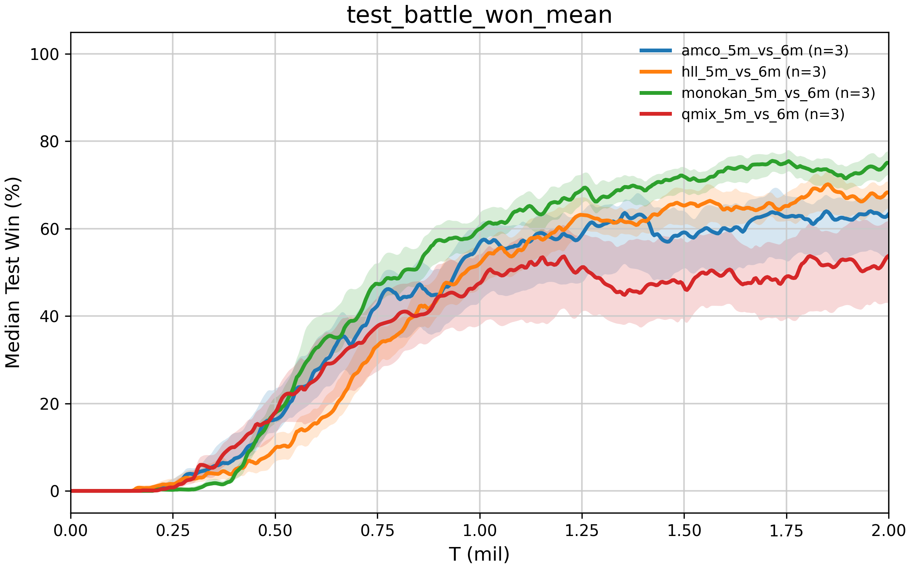

# 2026年07月16日

### 实验或 idea 的进展

#### 1\.1 实验进展

#### 1\.2 目前的想法

##### **Title**

**Beyond Hypernetworks: Partial Monotonic Mixing for Cooperative Multi\-Agent Reinforcement Learning**

##### **Key contribution**

PMIX 将“状态生成单调 mixer”推广为“状态直接参与条件部分单调函数逼近”，并在统一 IGM 理论下容纳多种可认证函数逼近器。

##### **Theory**

一个统一定义 \+ 一个 IGM 主定理 \+ 三个架构认证命题 \+ 一个逼近能力讨论

1. **Value Factorisation and IGM**：给出 CTDE、个体效用和 IGM 的问题定义。

2. **Partial Monotonic Mixing**：形式化定义可容许上下文、条件部分单调函数和 Direct\-Context PMIX。

3. **PMIX Guarantees IGM**：给出统一主定理和完整证明。

4. **Certified PMIX Instantiations**：分别给出 PMIX\-MLP、PMIX\-Lattice、PMIX\-KAN 的构造和认证命题。

5. **Approximation Capacity and Scope**：统一定义目标函数空间并讨论逼近能力，再分别说明三种实例能够安全主张的理论结论。

##### **Experiments**

1. **统一外层结构**

三个 PMIX 实例统一写为：$Q_{\mathrm{tot}}^{(a)}
=V_\omega(E_\psi(s))
+M_{\phi_a}^{(a)}(\mathbf q,E_\psi(s)),
\qquad
a\in\{\mathrm{MLP},\mathrm{Lat},\mathrm{KAN}\}.$

**主实验中必须统一：**

- 状态编码器 $E_\psi$ 的层数、激活和输出维度；

- $V_\omega$ 的层数和宽度；

- 是否使用 state\-dependent positive output scale；

- 是否使用 Q residual；

- agent network、learner 和 TD loss；

- replay buffer、target update、epsilon schedule；

- 训练与评估预算。

2. ****$V(s)$

当前代码中不同 mixer 对 state\_value 的实际使用并不一致。正式实验前应保证$V_\omega(s)$要么在三个 PMIX 实例中全部启用，要么全部关闭并作为统一消融。

推荐主模型全部启用，因为 QMIX 本身具有状态价值基线。另做一次 with $V(s)$ / without $V(s)$ 消融即可。

3. **state\-dependent output scale**

当前 HLL 独有$S_\xi(s)>0.$

它会直接改变 $Q_{\mathrm{tot}}$ 对个体 Q 的敏感度。正式实验应二选一：

1. 从 HLL 主模型移除；

2. 对三种 PMIX 都使用相同的$Q_{\mathrm{tot}}
=V(s)+S_\xi(s)M(\mathbf q,z).$

不能只在 PMIX\-Lattice 中保留后将提升解释为 lattice 优势。

4. **Q residual**

主比较建议不使用 Q residual：$R(\mathbf q)=0.$

原因是现有实验已经表明 residual 会显著改变优化路径，而且对 AMCO、HLL、MonoKAN 的影响不同。

将 residual 作为统一机制消融：$Q_{\mathrm{tot}}^{(+R)}
=Q_{\mathrm{tot}}
+\lambda(t)\frac{1}{n}\sum_iQ_i.$

比较：

- no residual；

- fixed residual；

- annealed residual。

三种 PMIX 必须使用相同的初值、终值和退火时间。现有 AMCO residual annealing 结果可以作为提出该消融的依据，但不能作为 PMIX\-MLP 主模型的专属增强。

#### 1\.3 存在的问题

不同地图中采用相同的配置不太可能，尤其是hll

