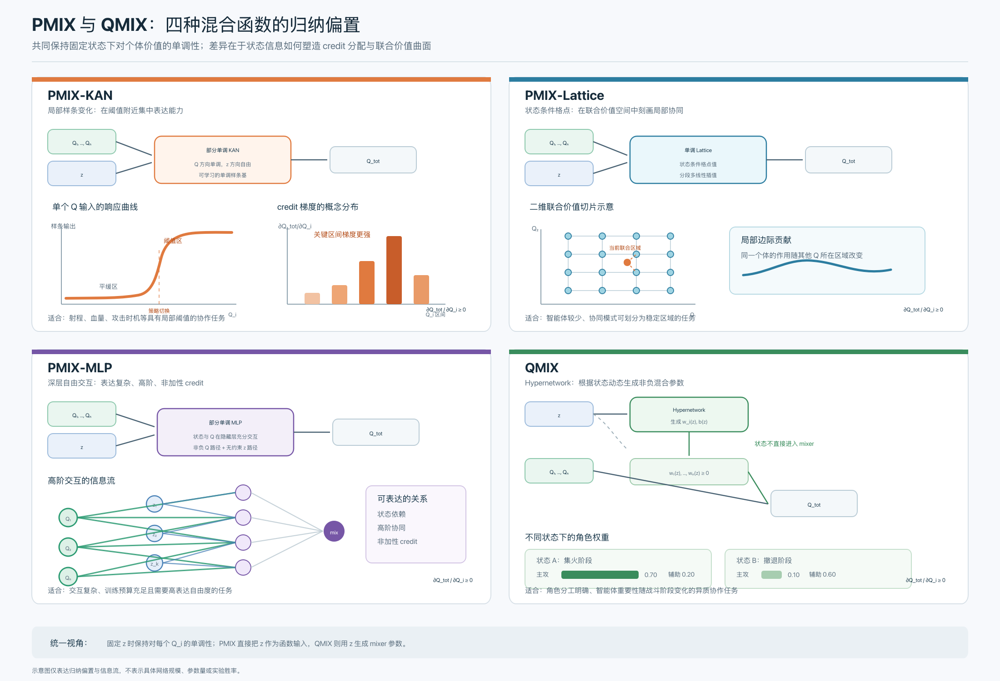

# 2026年07月30日

### 任务进程

* [x] 对范式的模型方法在所有地图上进行实验

* [x] amco理论来说模型能力最复杂、最强，但是效果不好，需要着重调一下

* [ ] hll的group方式也需要参考源码进行重新的分析和设计，尽量能优化一下

* [ ] 尝试其他星际争霸之外的其他实验环境

### 根据实验结果，对每种模型方法进行针对性分析

1. 每种模型方法的特点：

    1. **PMIX\-KAN**
    KAN 的单调样条可以在部分输入区间保持平缓，在关键区间快速变化，从而对射程、血量和攻击时机等阈值附近分配更强的 credit 梯度，而不要求整个价值函数保持相同斜率。因此，它特别适合具有明显局部阈值和策略切换的任务。这解释了其在 `3s_vs_5z` 这类依赖射程控制、集火时机以及攻击—撤退切换的地图上表现较好。

    2. **PMIX\-Lattice**
    Lattice 在联合个体价值空间中设置一组满足单调顺序的状态条件格点，并通过分段多线性插值构造 $Q_{\mathrm{tot}}$。因此，它能够直接表示“一个智能体的边际贡献随其他智能体价值区间而变化”的协同关系，同时保持局部价值面规则、稳定且容易施加单调约束。这使其更适合智能体数量较少、联合价值结构相对规则、协同模式能够被划分为若干稳定区域的任务。这解释了其在 `2s3z` 和 `5m_vs_6m` 上具有较好的学习效率或最终性能，但在需要尖锐策略切换的 `3s_vs_5z` 上容易受到格点斜率不足和输入校准饱和的影响。

    3. **PMIX\-MLP**
    部分单调 MLP 允许状态信息与所有个体 Q 在隐藏层中进行充分且无固定形式的交互，因此可以表示复杂的状态依赖、高阶和非加性 credit 关系。它不预设局部阈值、规则格点或个体加权等特定结构，因而具有更高的表达自由度；但也需要从 TD 信号中自行发现有效的 credit 分解，容易出现梯度较弱、状态价值分支先行拟合以及种子方差较大的问题。因此，它更适合交互关系复杂且训练预算充足的任务。这解释了其在 `3s_vs_5z` 上最终能够达到较高胜率，但在 `3s5z`、`5m_vs_6m` 和 `2c_vs_64zg` 上通常学习启动较慢。

    4. **QMIX**
    QMIX 使用 hypernetwork 根据全局状态直接生成非负混合权重，使每个智能体对 $Q_{\mathrm{tot}}$ 的边际贡献能够随状态快速变化，同时保留每个有序智能体的独立身份。因而，它天然适合表示“当前状态下哪个智能体或角色更加重要”的 credit 分配关系，尤其适用于单位类型不同、职责明确、个体重要性随战斗阶段变化的异质协作任务。这解释了其在 `3s5z` 和 `2c_vs_64zg` 上具有较高的样本效率和最终胜率；但在 credit 主要由射程、血量等局部非线性阈值决定时，这种状态条件加权未必是最合适的归纳偏置，因此在 `3s_vs_5z` 上学习明显晚于 PMIX\-KAN。

2. 目前出现的特殊情况或思考：

    1. PMIX\-Lattice 在 `3s_vs_5z` 上移除 residual 后出现明显退化，但进一步分析表明，这主要是因为原有 `temperature=2` 是与 residual 共同调出的配置；将 temperature 调整为适合无 residual 训练的值后，HLL 本身仍有能力正常学习。

    2. PMIX\-amco 理论能力最强，但实际效果不好

### 根据实验结果及模型分析，对每种方法提出问题原因以及尝试思路

1. 为什么 AMCO 理论能力强，实际效果却不好\(AMCO 的问题不像表达不足，而像状态/Q 通道失衡和深层单调网络的优化困难\)

    1. 状态通道比 Q 通道更容易拟合 TD target

    模型可能优先依赖：$V(z)+M(0,z)$, 降低 TD loss，而不是建立动作相关的 Q\-credit 通道。这会出现一种现象：critic 的预测逐渐改善，但$\frac{\partial Q_{\mathrm{tot}}}{\partial q_i}$仍然很小，agent 获得的动作区分信号不足。

    2. 深层单调网络的有效梯度可能过小

    AMCO 的 credit 梯度是多层正权重与激活导数的乘积：$\frac{\partial Q_{\mathrm{tot}}}{\partial q_i} = W_L^+D_{L-1}W_{L-1}^+\cdots D_1W_{1,i}^+.$非负不代表足够大。当前使用 ReLU，可能进一步产生大量局部零导数区域。

尝试思路：

1. 给当前 ReLU\-AMCO 加诊断指标并重跑三个代表地图；根据指标判断问题来源，第一步只加指标，不改任何模型参数

    1. Mixer credit 梯度：$g_i=\frac{\partial Q_{\mathrm{tot}}}{\partial Q_i}.$

    2. Credit 分配集中程度：$ \alpha_i=\frac{g_i}{\sum_jg_j+\epsilon}. $

    3. 状态分支与 mixing 分支幅值：$R_{V/M} = \frac{\operatorname{RMS}(V)} {\operatorname{RMS}(M)+\epsilon}.$

    4. 第一层状态/Q 输入比例：$R_{z/q} = \frac{\operatorname{RMS}(h_z)} {\operatorname{RMS}(h_q)+\epsilon}.$

2. HLL 在失败地图上究竟是 lattice 分辨率不足，还是 credit 链条中的尺度、校准、顶点斜率或状态分支出了问题？

HLL 的个体 credit 为  $\frac{\partial Q_{\mathrm{tot}}}{\partial q_i} = \underbrace{A(z)}_{\text{输出尺度}} \underbrace{\frac{\partial L}{\partial c_i}}_{\text{lattice slope}} \underbrace{\frac{c_i(1-c_i)}{T}}_{\text{Q 校准灵敏度}}. $, 因此 HLL 学不好只有几种主要可能：

1. $A(z)$ 太小；

2. lattice 相邻顶点差太小；

3. sigmoid 坐标饱和；

4. $V(z)$ 主导 TD 拟合；

5. 上述因素都正常，但 lattice 分辨率确实不足。

当前 learner 已经有通用的 `credit_grad_*` 指标。下一步应给 HLL 增加 `get_diagnostics()`，复用同一套日志机制。

尝试思路：

1. Output scale：$A(z)=\operatorname{softplus}(a(z))+A_{\min}. $ 可以判断 HLL 是否因为随机初始化产生很小或种子差异很大的 credit 尺度。

2. Sigmoid 校准:  $s_i=\frac{c_i(1-c_i)}{T},  \text{saturation} = \mathbf 1[c_i<0.05\ \lor\ c_i>0.95].$如果失败地图的 `hll_q_saturation_frac` 很高，继续增加 size 没有意义，因为输入已经集中在 lattice 边界。

3. 顶点差与 lattice slope：$\Delta_{i,\mathbf v_{-i}} = \theta_{v_i+1,\mathbf v_{-i}}(z) - \theta_{v_i,\mathbf v_{-i}}(z). $直接观察不同 agent 或单位类型是否获得了不同的 lattice credit。

4. 状态分支与 mixing 分支：$ M=A(z)\left(L-\frac12\right), R_{V/M} = \frac{\operatorname{RMS}(V)} {\operatorname{RMS}(M)+\epsilon}.$如果 $R_{V/M}$ 很高，说明 HLL 可能主要依靠 $V(z)$ 拟合 TD target，而 lattice 没有形成有效动作 credit。

### 实验结果

1. Amco: 综合胜率、梯度和 TD 统计，目前可以形成以下结论：

    **结论一：AMCO 的单调性认证是成立的**

    所有地图和 seed 上都没有观测到负的：$\frac{\partial Q_{\mathrm{tot}}}{\partial Q_i}. $

    因此当前失败不是 IGM 或单调性实现错误。

    **结论二：AMCO 在多数地图上具有有效的状态条件 credit 分配能力**

    尤其是 `3s5z`：

    - 8 个 agent 出现了清晰的 3\+5 组间 credit 差异；

    - 组间 credit 比约为 1\.5；

    - 说明状态条件化确实参与了角色分工。

    这支持 PMIX 的核心假设：状态直接参与部分单调混合函数后，可以表达比固定结构更丰富的 credit 关系。

    **结论三：****`5m_vs_6m`**** 的失败主要是优化病态，而非表达能力不足**

    1. 末期梯度统计如下：

        因此，不能把 `5m_vs_6m` 的失败解释为简单的“AMCO 梯度消失”。即使在该地图上，绝大多数样本的 credit 梯度仍然明显大于零。

        `5m_vs_6m` 后期的大致分布是：

        $p_{10}\approx0.21, \qquad \operatorname{median}\approx0.75, \qquad p_{90}\approx2.45.$ 

        这意味着，同一个训练阶段，不同状态和 transition 上的 credit 梯度可能相差十倍以上：

        $\frac{p_{90}}{p_{10}} \approx \frac{2.45}{0.21} \approx 11.7.$

        也就是说：

        - 有些 transition 的 $Q_i$ 对 $Q_{\mathrm{tot}}$ 影响只有约 0\.2；

        - 有些 transition 的影响达到 2\.5；

        - 极端样本甚至达到 5–8 左右。

        这不是梯度太小，而是不同样本的梯度尺度非常不一致。

        对应的变异系数：$\mathrm{CV} = \frac{\operatorname{Std}(g)} {|\operatorname{Mean}(g)|+\epsilon} $

        也从训练早期约 0\.45，上升到后期约 0\.91：

        可以看到，随着训练进行：

        - 下尾部不断下降；

        - 上尾部仍然很大；

        - 中位数下降；

        - 分布相对离散程度接近翻倍。

        因此更准确地说，它出现了 credit Jacobian 的条件数恶化，而不是整体缩小为零。

        更准确的结论是：

        > AMCO 的表达能力和单调性都没有问题，但其状态条件化结构可能在复杂同质协作任务中造成较差的优化条件数。
        > 
        > 

    **结论四：理论上的 universal approximation 不等于 RL 优化上的可训练性**

    当前实验非常适合支持文章中的一个重要讨论：

    $\text{approximation capacity} \neq \text{optimization stability}.$

    AMCO 可以满足部分单调函数逼近和 IGM 约束，但在实际 Q\-learning 中，仍可能因为：

    - 状态条件 Jacobian 的高方差；

    - 不同 transition 上 credit 梯度尺度差异过大；

    - TD target 的非平稳性；

    - 单调网络参数化的局部条件数问题；

    而表现出训练不稳定。

2. HLL 并不存在统一的“梯度消失”问题。真正严重的问题集中在 `MMM2 seed=141` 的 Q 坐标饱和；而 `3s_vs_5z` 表现较弱，却不是由普通梯度消失、输出尺度过小或 lattice 整体变平造成的。

    **三个 MMM2 seed 已经分成明显的成功轨迹和失败轨迹。**

    另外，seed=41 早期也曾出现约 31%–47% 的饱和，但之后恢复到接近零并开始学习。这说明短暂饱和不必然失败，真正危险的是持续饱和并不断恶化。

    **三个 ****`3s_vs_5z`**** 当前胜率差异较大，但诊断没有发现典型瓶颈，**

    更可能的解释是：

    - 当前 credit 曲面的几何形状不适合 kiting、集火和临界生存决策；

    - size=6 的深层 lattice 优化比较困难；

    - agent 网络产生的 $Q_i$ 表示或探索轨迹没有进入合适策略区域；

    - 梯度存在，但未必指向对协作策略最有用的 credit 分配。

    **结论一：不存在一个简单的“最佳温度”**

    较小 T：梯度上限更大；但容易进入 sigmoid 饱和。

    较大 T：能避免硬饱和；但会降低整个有效区间的梯度。

    温度决定的是 calibration–gradient trade\-off，而不仅仅是输入范围。

    **结论二：更小的 lattice 不一定更容易优化**

    K2 减少了顶点数和递归深度，但也改变了：

    - 初始 effective slope；

    - agent Q 的训练动力学；

    - sigmoid 坐标分布；

    - state\-conditioned vertex 学习速度。

    所以“参数更少、层级更浅”不等于“训练更稳定”。

    **结论三：Credit entropy 高不代表 credit assignment 正确**

    两个失败 seed：

    - MMM2 T2 seed41：entropy 约 `0.956`

    - 3s K2 seed41：entropy 约 `0.918`

    它们的 credit 很均衡，却没有学会策略。均衡 credit 只说明没有某个 agent 垄断梯度，不代表梯度方向和幅度适合任务。

### 

